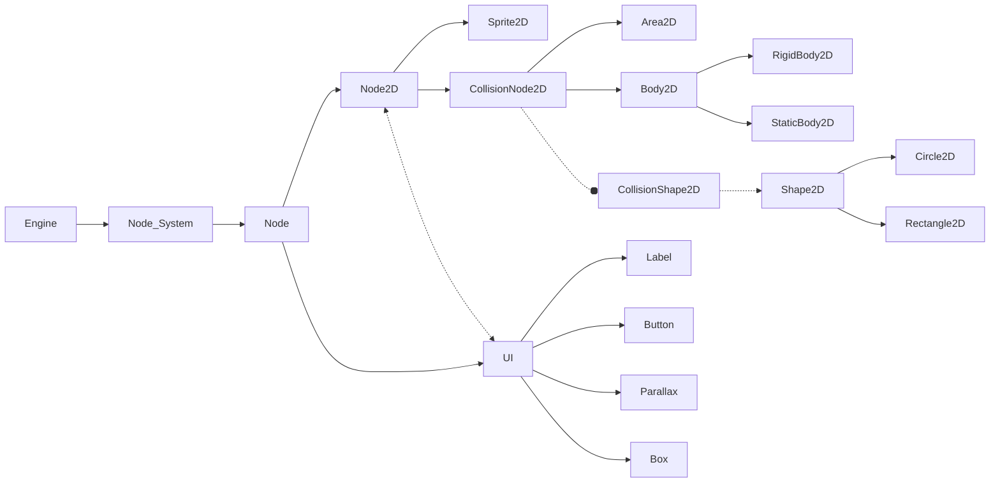

## Node System

### Introduction

#### What is the Entity System ?
The Entity System Engine is a lightweight 2D framework built to simplify the
creation and management of entities through a Node-based hierarchy.
Designed for flexibility and modularity, it provides developers with the tools
to efficiently structure and manage game objects, UI, and physics in a 2D
environment.

The engine is implemented in `C++` for performance and exposes its
functionality through `Luau`, allowing developers to script and control every
aspect of the system easily.

#### Inspiration
This Entity System Engine is directly inspired by the one in Godot.
The design pattern is inspired by the one in Garry's Mod.
[Godot-Documentation](https://docs.godotengine.org/en/stable/)

### Architecture Overview

The Node system is the heart of the engine. It is a block-based system designed
to add functionalities more easily. This approach ensures clearer organization
and helps avoid scattering during the creation of elements.
It organizes entities, facilitates their manipulation and modification by
adding and managing properties.
Each node can :

- Inherit properties (e.g., position, rotation) from its parent.
- Add specialized behavior through extensions or child nodes.

### Core Concepts

There is first a basic description of the elements, followed by a detailed
explanation in [References](#references--key-methods), which includes their usage
and what they do.
Below is a schematic of the Node System architecture.

#### System Graph

- #### Node
    A node is a module made up of one or more blocks, similar to an Entity System.
    In this Node System, the diversity of blocks is classified and organized
    according to defined functionalities.
    For example, a Node UI does not need to use a collision system.
    In the following, we'll look at each part of the block and its child nodes
    in detail.

- #### Node2D
    Node2D is the heart of the element management system for our video games.
    It contains all the methods and child nodes needed to manage:
    
    - 2D sprites
    - 2D camera
    - Other objects and their collision system

    The system works with functionality assignments. For example, you can
    create a rectangular object and decide whether or not it will conflict
    with other objects, and specify which ones.
    The objects are at least composed by a position and a size.

    - #### Sprite2D
        This is the implementation of 2D Sprite handling, managed as a 2D
        object that has no physical constraints and is positioned and drawn
        in the scene. It is reduced as a 2D rectangle.

    - #### CollisionNode2D
        CollisionNode2D is the starting point for managing elements with
        physics. This allows you to isolate, identify and simply discriminate
        all 2D objects other than sprites.

        All CollisionNode2D dependent items can be primitively described as
        2D rectangular objects with a position and size defined at the time of
        their creation. These entities can then be detailled into other object
        types, which will be described in more detail below.

        - #### Area2D

            Area2D is a simple 2D object, dimensioned and positioned in the
            scene, to which a collision zone can be assigned. This object
            cannot be in motion.
        
        - #### Body2D

            Body2D is a 2D object that can be declined into 2 other items:
            StaticBody2D and RigidBody2D.
            
            As with most CollisionNode2D child nodes, Body2D and its child
            nodes are represented by a rectangle2D and can have a collision system.

            - #### StaticBody2D
                It's a 2D object which, as its name suggests, is static.
                It is not in motion, only positioned in the scene. It can
                be used as a decorative element, for example.

            - #### RigidBody2D
                This is a 2D object which, unlike StaticBody2D, is in motion.
                It takes an additional velocity parameter when constructed.
            

        - #### CollisionShape2D & Shape2D
            CollisionShape2D is directly associated with Shape2D.
            CollisionShape2D groups together collision detection and
            management systems. Together with Shape2D, they also create and
            manage the 2D child objects described below.

            Shape2D is the parent node of 2 other 2D object declinations:
            Rectangle2D and Circle2D. Simply, a 2D Rectangle dimensioned and
            positioned in the scene, and the same for the Circle. Each of these
            2D objects has a Bounding Box, it's an expression of the maximum
            extents of a two-dimensional object (e.g. point, line, polygon) or
            set of objects within its x-y coordinate system. Represented by a
            rectangle.
            [+Infos](https://en.wikipedia.org/wiki/Minimum_bounding_rectangle)

            Collisions between objects are verified in multiple steps. First,
            a collision check is performed based on the bounding box. If this
            check is true, a more detailed collision verification is performed
            directly between the objects. This approach avoids unnecessary
            complex calculations between shapes like rectangles and circles.

- #### UI Nodes
    UI Nodes is a 2D element management system that differs from Node2D.
    The difference is mainly due to the relative position of
    the elements. In Node2D, positions are relative to the scene, whereas
    UI Nodes' positions are relative to the screen.

    All child elements are managed from this UI Node. It will manage global
    positions and color.
    
    UI Nodes contains the elements needed to create a UI, i.e. Labels, Buttons,
    Boxes and finally Parallaxes, which are described below.

    - #### Label
        Label is a UI text positioned in the screen. It can be given a font size.
    
    - #### Parallax
        The parallax node is a 2D graphical element used to create a depth
        effect. It's a texture that can be moved by an offset or relative to a
        Node2D reference (for simultaneous movement).
        Positioned in the scene, it also has a supperposition index. 0 being
        the furthest away from the user.

    - #### Box
        Box is a 2D rectangle positioned in the screen. It can be used for UI
        elements such as menus.