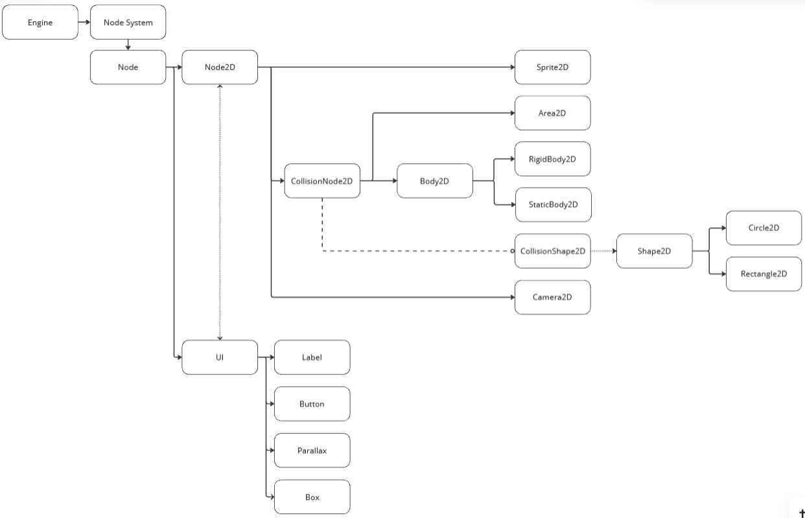

# Common

## Introduction

This section contains the common luau methods for the server and client.

#### System Graph

## Nodes

- [Node](./NodeLibrary.md)
- [Node2D](./Node2DLibrary.md)
- [Sprite2D](./Sprite2DLibrary.md)
- [Area2D](./Area2DLibrary.md)
- [RigidBody2D](./RigidBody2DLibrary.md)
- [StaticBody2D](./StaticBody2DLibrary.md)
- [CollisionShape2D](./CollisionShape2DLibrary.md)
- [Label](./LabelLibrary.md)
- [Parallax](./ParallaxLibrary.md)
- [Box](./BoxLibrary.md)

## Registered Node Type & Construction Method

|   Node Type   | Construction Method  |
| ------------- | ------------- |
|  Node         | CreateChild("Node", "name")|
|  Node2D       | CreateChild("Node2D", "name")|
|  Sprite2D     | CreateChild("Sprite2D", "name", "source")|
|  Area2D       | CreateChild("Area2D", "name", posX : number, posY : number, width : number, height : number)|
|  RigidBody2D  | CreateChild("RigidBody2D", "name", posX : number, posY : number, width : number, height : number, velocityX : number, velocityY : number)|
|  StaticBody2D | CreateChild("StatiCBody2D", "name", posX : number, posY : number, width : number, height : number)|
|  CollisionShape2D - Rectangle2D| CreateChild("CollisionShape2D", "name", type : "Rectangle", posX: number, posY : number, width : number, height : number)|
|  CollisionShape2D - Circle2D| CreateChild("CollisionShape2D", "name", type : "Circle", posX: number, posY : number, radius : number)|
|  Label        | CreateChild("Label", "name", posX : number, posY : number, "text", "fontSource", fontSize : number)|
|  Parallax     | CreateChild("Parallax", "name", "source", scrollingVelocity : number, NodeReference)|
|  Box          | CreateChild("Box", "name", posX : number, posY : number, width : number, height : number)|